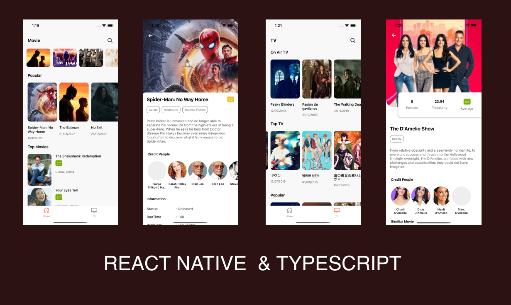

# MovieRN

Sample project built with React Native and TypeScript  implements api from [themoviedb](http://themoviedb.org).

<p></p>

## Getting Started
- add apiKey TheMovieDb on `src/config/env.config.tsx (line 1)`

```
npm install
npx pod-install ios (iOS)
npm run ios (iOS)
npm run android (Android)
```

#### Libraries

* [Realm](https://docs.mongodb.com/realm/sdk/react-native/)
* [Axios](https://www.npmjs.com/package/react-native-axios)
* [Date-fns](https://www.npmjs.com/package/date-fns)
* [Device Info](https://github.com/react-native-device-info/react-native-device-info)
* [React Navigation](https://reactnavigation.org/)
* [Shimmer](https://github.com/tomzaku/react-native-shimmer-placeholder)
* [Ionicons](https://www.npmjs.com/package/react-native-ionicons)
